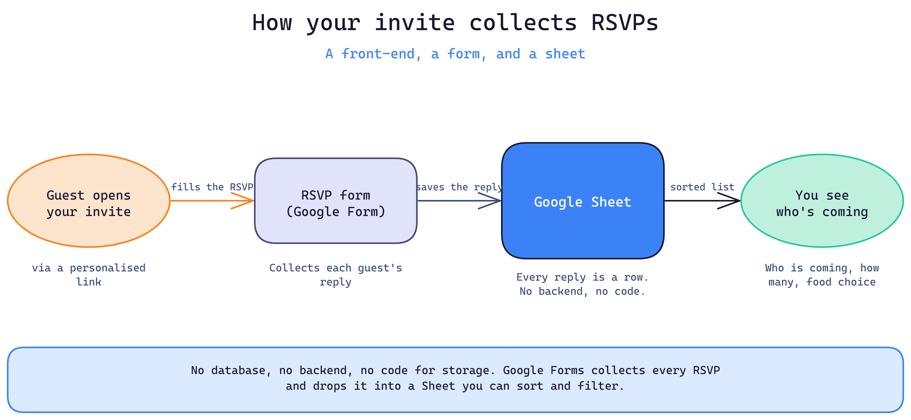

# Project Background

Client requirement was to send out wedding invitations to his Friends and relatives, instead circulating the normal invitations images through Whatsapp. 

Client wanted to send out personalised invitations with the event date, location and to track the guest list through google forms.

# Impelementation Plan

- The invite site (front-end): the pages your guests see. HTML, CSS, and JavaScript, the building blocks.

- Personalised links: the guest's name is read from the link (for example ?name=Asha) and shown on the page. No separate page per guest.

- Google Form: To collect the data. It takes each guest's reply.

- Google Sheet: To store the data. Every reply lands here as a row, no backend or database to build.

# How it works

# The Process

- Generated the product requirement document by explaining the project requirements to ChatGPT and got the .md prd file which was used to write the code by an AI dev tool Antigravity.

- Broke down the .md prd file to multiple phased based tasks and implemented the code phase by phase and tested it and fixed the bugs along with it.

# Results

A shareable wedding invite link with guest list tracking through google sheets.

