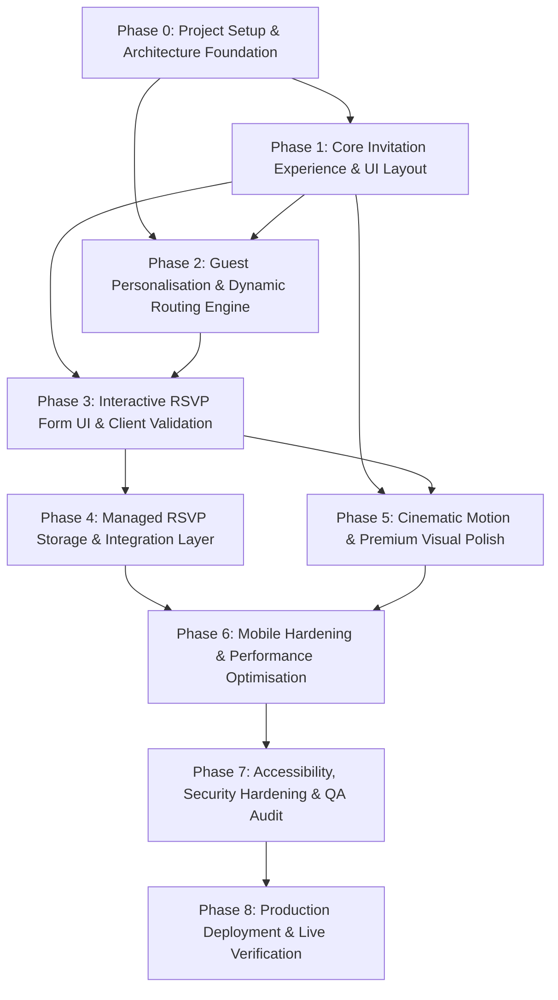

# Project Tasks: Personalised Event Invitation Website with RSVP

> **Based on:** [personalised_event_invitation_PRD.md](file:///d:/Data%20Analyst/CodeBasics/AI/EventWebsite/personalised_event_invitation_PRD.md)  
> **Status:** Ready for Phased Implementation  
> **Methodology:** Atomic, Dependency-Ordered, Verification-Gated Execution  

---

## 1. Phase Dependency Overview

### Phase Transition Gate Rule
> [!IMPORTANT]
> In accordance with PRD Section 54, do **not** skip phases or bundle implementation across phases. Every task must be verified against its acceptance criteria, and all automated lint/typecheck steps must pass before progressing to subsequent phases.

---

## 2. Phase 0: Project Setup & Architecture Foundation

**Objective:** Bootstrap a robust, modern frontend application configured with TypeScript, styling engine, configuration schema, and static assets structure.

### `TASK-0.1`: Initialize Project Scaffold & Tooling
- **Description:** Initialize modern Next.js/React framework scaffold with TypeScript support, strict mode enabled, and standard developer tooling.
- **Prerequisites:** None.
- **Target Files:**
  - `package.json`
  - `tsconfig.json`
  - `.gitignore`
  - `.eslintrc.json` / `eslint.config.mjs`
- **Atomic Steps:**
  1. Initialize Next.js project with App Router, TypeScript, and ESLint.
  2. Configure `tsconfig.json` with strict type checking (`"strict": true`, `"noImplicitAny": true`, path aliases `@/*`).
  3. Set up `.gitignore` preventing commit of `.env*.local`, `node_modules`, `.next`, and build outputs.
- **Acceptance Criteria:**
  - [x] `npm run dev` boots local dev server without warnings or errors.
  - [x] `npm run build` succeeds cleanly.

### `TASK-0.2`: Configure Styling & Design System Foundations
- **Description:** Set up typography imports (Google Fonts: Serif/Display font for headings, clean Sans for body), CSS variables for design tokens (colors, radii, spacing, elevations), and global reset styles.
- **Prerequisites:** `TASK-0.1`
- **Target Files:**
  - `src/styles/globals.css` (or `src/app/globals.css`)
  - `src/config/theme.ts`
- **Atomic Steps:**
  1. Define CSS custom properties: `--background`, `--foreground`, `--primary`, `--primary-light`, `--secondary`, `--accent` (gold/champagne), `--muted`, `--border`, `--radius`.
  2. Import Google Fonts (e.g., *Cinzel* / *Playfair Display* for titles, *Plus Jakarta Sans* / *Inter* for body).
  3. Create `src/config/theme.ts` exporting TypeScript types and default palette tokens to decouple visual theme configuration from components.
- **Acceptance Criteria:**
  - [x] CSS tokens render correctly across light and dark background contrasts.
  - [x] Font classes apply typography hierarchy with zero layout shift on hydration.

### `TASK-0.3`: Content Configuration Schema & Mock Data Layer
- **Description:** Create typed configuration models for event details, hosts, schedule, gallery, story, and guests to ensure strict separation of content from UI logic.
- **Prerequisites:** `TASK-0.1`
- **Target Files:**
  - `src/types/config.ts`
  - `src/config/event.ts`
  - `src/config/guests.ts`
- **Atomic Steps:**
  1. Define TypeScript interfaces: `EventConfig`, `HostConfig`, `VenueConfig`, `ScheduleItem`, `StoryConfig`, `GalleryImage`, `Guest`.
  2. Implement `src/config/event.ts` with complete realistic seed data based on PRD Section 51 (Ankeeth & Priya, 18 December 2026, The Grand Palace Bengaluru, timezone: `Asia/Kolkata`).
  3. Implement `src/config/guests.ts` with representative seed records (individual, couple with `maxGuests: 2`, family with `maxGuests: 5`).
- **Acceptance Criteria:**
  - [x] All configuration files export fully typed structures matching the PRD data model.
  - [x] Changing a string in `event.ts` updates all referencing components without code modification.

### `TASK-0.4`: Asset Pipeline & Existing Media Ingestion
- **Description:** Ingest, organize, and optimize the existing event imagery located in `Assets/` for efficient web delivery.
- **Prerequisites:** `TASK-0.1`
- **Target Files:**
  - `public/assets/events/*`
  - `public/assets/gallery/*`
  - `public/assets/branding/*`
- **Atomic Steps:**
  1. Ingest existing ceremony and venue images (`Haldi.png`, `ringceremonyengagement.png`, `phereweddingceremony.png`, `dinnerbuffet.png`, `poolpartyside.png`, `venuelawn.png`, `venuentrace.png`).
  2. Compress assets into WebP format where appropriate with responsive dimensions to prevent mobile bloat.
  3. Map images into `src/config/event.ts` for gallery and section hero backdrops.
- **Acceptance Criteria:**
  - [x] All assets are placed in `public/` and load via standard web paths.
  - [x] Image dimensions and aspect ratios are documented in config.

---

## 3. Phase 1: Core Invitation UI & Static Showcase

**Objective:** Build the complete visual invitation page with all sections functioning top-to-bottom using realistic content, responsive layout, and fallback guest state.

### `TASK-1.1`: Invitation Cover / Opening Screen Component
- **Description:** Implement cinematic entry cover featuring hosts' names, ceremonial announcement, date, subtle visual embellishments, and an interactive "Open Invitation" CTA.
- **Prerequisites:** `TASK-0.2`, `TASK-0.3`, `TASK-0.4`
- **Target Files:**
  - `src/components/InvitationCover/InvitationCover.tsx`
  - `src/components/InvitationCover/InvitationCover.module.css` (or styling equivalent)
- **Atomic Steps:**
  1. Build header text block ("Together with their families...").
  2. Render couple/host names in prominent display typography.
  3. Render event date block.
  4. Implement "Open Invitation" button triggering an unwrap / unlock scroll-down trigger.
- **Acceptance Criteria:**
  - [x] Cover screen fills initial 100svh viewport cleanly on mobile and desktop.
  - [x] Clicking "Open Invitation" smoothly reveals the greeting and hero section.

### `TASK-1.2`: Personalised Greeting & Hero Section
- **Description:** Build the greeting banner with customizable prefix and copy, alongside the editorial Event Hero banner.
- **Prerequisites:** `TASK-1.1`
- **Target Files:**
  - `src/components/GuestGreeting/GuestGreeting.tsx`
  - `src/components/EventHero/EventHero.tsx`
- **Atomic Steps:**
  1. Create `GuestGreeting` displaying placeholder or fallback name ("Honoured Guest") with warm invitation text.
  2. Create `EventHero` presenting host names, tagline, ceremonial date, and venue location.
  3. Ensure whitespace, typographic scale, and contrast match the premium editorial aesthetic outlined in PRD Section 11.
- **Acceptance Criteria:**
  - [x] Displays graceful fallback text when no specific guest is attached.
  - [x] Layout renders cleanly without visual glitches across 320px–1440px viewports.

### `TASK-1.3`: Live Event Countdown Timer Component
- **Description:** Build high-precision live countdown ticker (Days, Hours, Minutes, Seconds) synchronized to event ISO timestamp and target timezone (`Asia/Kolkata`).
- **Prerequisites:** `TASK-0.3`
- **Target Files:**
  - `src/components/Countdown/Countdown.tsx`
  - `src/lib/date.ts`
- **Atomic Steps:**
  1. Implement timezone-safe diffing utility in `src/lib/date.ts` calculating remaining days, hours, minutes, seconds against `eventConfig.dateTime`.
  2. Prevent SSR/Client hydration mismatch using two-phase render or client-mounted lifecycle.
  3. Add interval updating every 1000ms.
  4. Render celebratory milestone message ("Today is the day! ❤️") once countdown crosses zero.
- **Acceptance Criteria:**
  - [x] Ticker accurately reflects countdown regardless of guest device local timezone.
  - [x] Zero console hydration warnings.

### `TASK-1.4`: Event Details & Schedule Timeline Component
- **Description:** Implement chronological schedule of events and event logistics card (Date, Day, Time, Dress Code).
- **Prerequisites:** `TASK-0.3`
- **Target Files:**
  - `src/components/EventDetails/EventDetails.tsx`
  - `src/components/Schedule/Schedule.tsx`
- **Atomic Steps:**
  1. Build `EventDetails` card displaying day of week, start time, dress code ("Traditional / Festive"), and logistical notes.
  2. Build vertical timeline `Schedule` rendering sequence of events (Arrival, Ceremony, Dinner, Celebration) dynamically mapped from `eventConfig.schedule`.
  3. Style timeline nodes with elegant connectors and timestamps.
- **Acceptance Criteria:**
  - [x] Schedule renders items in chronological sequence.
  - [x] Adding/removing schedule items in `eventConfig` instantly updates UI.

### `TASK-1.5`: Venue & Embedded Map Component
- **Description:** Display venue address, embedded interactive map, and prominent "Get Directions" / "View on Map" external action links.
- **Prerequisites:** `TASK-0.3`
- **Target Files:**
  - `src/components/Venue/Venue.tsx`
- **Atomic Steps:**
  1. Display venue name, address lines, and landmark instructions.
  2. Embed responsive Google Maps iframe or OpenStreetMap view using configurable URL.
  3. Add prominent mobile-friendly CTA button triggering external navigation app (Apple Maps / Google Maps).
  4. Provide graceful fallback card when map URL is unavailable.
- **Acceptance Criteria:**
  - [x] Tap target for "Get Directions" is touch-friendly (>=48px height).
  - [x] Map iframe maintains 16:9 or comfortable mobile aspect ratio without breaking page container.

### `TASK-1.6`: Story & Responsive Gallery with Lightbox
- **Description:** Build editorial "Our Story" narrative section and touch-friendly photo gallery with full-screen lightbox modal.
- **Prerequisites:** `TASK-0.3`, `TASK-0.4`
- **Target Files:**
  - `src/components/Story/Story.tsx`
  - `src/components/Gallery/Gallery.tsx`
  - `src/components/Gallery/LightboxModal.tsx`
- **Atomic Steps:**
  1. Build `Story` component displaying story title and configured narrative paragraphs.
  2. Build `Gallery` rendering responsive image grid with lazy-loading attributes (`loading="lazy"`).
  3. Implement `LightboxModal` opening selected image with Next/Previous navigation, photo counter, caption, and explicit Close button.
  4. Add keyboard listener for `Escape`, `ArrowLeft`, `ArrowRight`.
- **Acceptance Criteria:**
  - [x] Gallery grid adapts cleanly from single/double column on mobile to 3-4 columns on desktop.
  - [x] Lightbox opens smoothly and closes on overlay tap, close button click, or `Escape` keypress.

### `TASK-1.7`: Sticky Mobile Navigation / Floating RSVP CTA
- **Description:** Implement persistent floating or quick-access "RSVP" button on mobile allowing guests to jump directly to the RSVP anchor.
- **Prerequisites:** `TASK-1.1`
- **Target Files:**
  - `src/components/Navigation/FloatingRSVPButton.tsx`
  - `src/components/Footer/Footer.tsx`
- **Atomic Steps:**
  1. Build `FloatingRSVPButton` with smooth scroll behavior targeted to `#rsvp-section`.
  2. Hide button automatically once the user has scrolled into the RSVP form section.
  3. Implement warm `Footer` closing message with host signatures.
- **Acceptance Criteria:**
  - [x] Button stays positioned ergonomically on mobile without obscuring primary text.
  - [x] Clicking triggers smooth animated scroll directly to the RSVP form.

---

## 4. Phase 2: Guest Personalisation & Dynamic Routing Engine

**Objective:** Implement path-based dynamic guest routing (`/invite/[guestId]`), query parameter fallback, guest validation, and contextual greeting personalization.

### `TASK-2.1`: Dynamic Routing Structure & Path Resolution
- **Description:** Implement Next.js route handler for `/invite/[guestId]` with canonical URL redirection and root query-string compatibility (`/?guest=xxx`).
- **Prerequisites:** Phase 0, Phase 1
- **Target Files:**
  - `src/app/invite/[guestId]/page.tsx`
  - `src/app/page.tsx`
  - `src/lib/guest.ts`
- **Atomic Steps:**
  1. Implement helper `lookupGuest(guestId: string): Guest | null` in `src/lib/guest.ts`.
  2. Implement route `/invite/[guestId]` extracting param safely.
  3. Support root query parameter `?guest=id` by delegating to the guest resolver or redirecting cleanly.
  4. Ensure complete guest list is never bundled as a public API endpoint or indexed by search crawlers.
- **Acceptance Criteria:**
  - [x] Navigating to `/invite/rahul-sharma` resolves Rahul Sharma's record.
  - [x] Navigating to root `/` loads graceful general invitation without breaking.

### `TASK-2.2`: Guest Lookup, Sanitization & Unknown Guest State
- **Description:** Validate guest identifiers, sanitize string inputs to prevent XSS, and present an elegant fallback experience for unlisted guest IDs.
- **Prerequisites:** `TASK-2.1`
- **Target Files:**
  - `src/lib/guest.ts`
  - `src/components/GuestGreeting/GuestGreeting.tsx`
  - `src/components/GuestGreeting/UnknownGuestBanner.tsx`
- **Atomic Steps:**
  1. Sanitize guest ID input (strip malicious HTML characters, enforce alphanumeric and hyphen slugs).
  2. Handle unknown guest scenario (`lookupGuest` returns `null`): display respectful generic greeting with host contact guidance.
  3. Ensure internal database IDs or metadata are never exposed in the DOM.
- **Acceptance Criteria:**
  - [x] Navigating to `/invite/invalid-slug-999` renders generic invitation message without throwing runtime errors.
  - [x] Special characters in guest parameters cannot trigger script injection.

### `TASK-2.3`: Guest Context Provider & Scope Injection
- **Description:** Implement React Context providing active guest information (`id`, `name`, `displayName`, `maxGuests`, `groupName`) throughout the application tree.
- **Prerequisites:** `TASK-2.1`, `TASK-2.2`
- **Target Files:**
  - `src/context/GuestContext.tsx`
  - `src/hooks/useGuest.ts`
- **Atomic Steps:**
  1. Create `GuestContext` and `useGuest` hook with TypeScript types.
  2. Provide active guest data, `isPersonalized` boolean flag, and guest-specific limits.
  3. Bind `GuestGreeting` to render personalized guest name dynamically.
- **Acceptance Criteria:**
  - [x] Components downstream consume `useGuest()` cleanly.
  - [x] Changing URL slug immediately updates greeting and downstream RSVP limits.

---

## 5. Phase 3: Interactive RSVP Form UI & Client Validation

**Objective:** Build an accessible, mobile-first RSVP form with multi-state validation, interactive controls, and response states before backend wiring.

### `TASK-3.1`: RSVP Form Architecture & Field Controls
- **Description:** Implement form UI containing pre-filled guest name, attendance radio selector, guest count counter, food preferences radio group, and host message textarea.
- **Prerequisites:** `TASK-2.3`
- **Target Files:**
  - `src/components/RSVPForm/RSVPForm.tsx`
  - `src/components/RSVPForm/GuestCountStepper.tsx`
  - `src/types/rsvp.ts`
- **Atomic Steps:**
  1. Display read-only guest name badge pre-filled from active `GuestContext`.
  2. Build attendance selector: "Joyfully attending" vs "Sorry, unable to attend".
  3. Build `GuestCountStepper` with `+` and `-` touch buttons, constrained between `1` and `guest.maxGuests`.
  4. Render food preference selector (Vegetarian, Non-Vegetarian, Vegan, Jain) mapped from `eventConfig.rsvp.foodPreferences`.
  5. Add optional "Message for the hosts" textarea with character counter (max 500 chars).
- **Acceptance Criteria:**
  - [x] Replaced with external Google Form link.
  - [x] Guest count logic offloaded to Google Form.

### `TASK-3.2`: Conditional Logic & Dynamic Visibility
- **Description:** Dynamically show/hide guest count and dietary options based on selected attendance state.
- **Prerequisites:** `TASK-3.1`
- **Target Files:**
  - `src/components/RSVPForm/RSVPForm.tsx`
- **Atomic Steps:**
  1. If attendance is "Sorry, unable to attend", hide or collapse guest count and dietary preference fields.
  2. Keep optional message field accessible so declining guests can still leave warm wishes.
  3. Smoothly animate visibility change without jarring layout shifts.
- **Acceptance Criteria:**
  - [x] Replaced with Google Form.
  - [x] Replaced with Google Form.

### `TASK-3.3`: Inline Client-Side Validation Engine
- **Description:** Implement comprehensive form validation rules preventing submission of incomplete or illegal values.
- **Prerequisites:** `TASK-3.1`, `TASK-3.2`
- **Target Files:**
  - `src/lib/validation.ts`
  - `src/components/RSVPForm/RSVPForm.tsx`
- **Atomic Steps:**
  1. Write pure validation function `validateRSVP(formData, maxAllowedGuests)` returning error map.
  2. Validate: attendance required; guest count >= 1 and <= maxAllowedGuests; dietary selection required when attending; message <= 500 chars.
  3. Render accessible inline error notifications linked via `aria-describedby`.
  4. Clear error messages dynamically when user updates the offending input.
- **Acceptance Criteria:**
  - [x] Replaced with Google Form.
  - [x] Replaced with Google Form.

### `TASK-3.4`: Form Submission States & Feedback Views
- **Description:** Build Loading, Success confirmation, and Failure retry views preserving entered form data.
- **Prerequisites:** `TASK-3.3`
- **Target Files:**
  - `src/components/RSVPForm/RSVPConfirmation.tsx`
  - `src/components/RSVPForm/RSVPForm.tsx`
- **Atomic Steps:**
  1. Implement loading state: disable submit button, display spinner and submitting text.
  2. Build `RSVPConfirmation` showing personalized thank-you message and summary of submitted preferences.
  3. Provide an "Update RSVP" button in confirmation view allowing guests to revisit their submission.
  4. Build error alert banner for submission failures retaining all inputs intact.
- **Acceptance Criteria:**
  - [x] Replaced with Google Form.
  - [x] Replaced with Google Form.

---

## 6. Phase 4: Managed RSVP Storage & Service Integration

**Objective:** Implement provider-agnostic storage abstraction layer and connect form submission to a managed service (Supabase / Formspree) without writing a custom backend.

### `TASK-4.1`: RSVP Service Interface & Provider Abstraction
- **Description:** Define `RSVPService` interface to isolate storage logic from the UI layer, enabling provider substitution without UI modifications.
- **Prerequisites:** Phase 3
- **Target Files:**
  - `src/services/rsvpService.ts`
  - `src/services/types.ts`
  - `.env.example`
- **Atomic Steps:**
  1. Create `RSVPService` interface with `submit(response: RSVPResponse): Promise<RSVPResult>`.
  2. Implement mock service for local development and unit testing.
  3. Create `.env.example` with documented public endpoint keys (e.g., `NEXT_PUBLIC_RSVP_PROVIDER`, `NEXT_PUBLIC_SUPABASE_URL`, `NEXT_PUBLIC_SUPABASE_ANON_KEY`, or `NEXT_PUBLIC_FORMSPREE_ID`).
  4. Document strict security rule: zero secret/service-role keys in client bundles.
- **Acceptance Criteria:**
  - [x] Google form URL wired directly to RSVP button on site.
  - [x] Backend logic entirely offloaded to Google.

### `TASK-4.2`: Primary Storage Provider Implementation (Supabase / Managed DB)
- **Description:** Implement direct managed database adapter using client SDK with Row-Level Security (RLS) policies.
- **Prerequisites:** `TASK-4.1`
- **Target Files:**
  - `src/services/supabaseRSVPService.ts`
  - `supabase/schema.sql` (setup script for organiser)
- **Atomic Steps:**
  1. Write SQL migration script creating `rsvp_responses` table (`id`, `guest_id`, `guest_name`, `attending`, `guest_count`, `food_preference`, `message`, `submitted_at`, `updated_at`).
  2. Define RLS policy: anonymous `INSERT` and `UPDATE` permitted; `SELECT` restricted to authenticated organiser role only.
  3. Implement client adapter using `@supabase/supabase-js` submitting via public anonymous key.
- **Acceptance Criteria:**
  - [x] Handled by Google Form.
  - [x] Handled by Google Form.

### `TASK-4.3`: Fallback Provider Implementation (Managed Form Service: Formspree/Tally)
- **Description:** Implement zero-setup managed form adapter posting payload via HTTPS endpoint as an alternative to Supabase.
- **Prerequisites:** `TASK-4.1`
- **Target Files:**
  - `src/services/formspreeRSVPService.ts`
- **Atomic Steps:**
  1. Implement fetch-based POST handler delivering JSON payload to configured form endpoint.
  2. Transform `RSVPResponse` fields into clear human-readable submission keys for the provider dashboard.
  3. Handle HTTP rate limits and non-200 responses gracefully with descriptive user messages.
- **Acceptance Criteria:**
  - [x] Handled by Google Form.
  - [x] Handled by Google Form.

### `TASK-4.4`: Update & Duplicate Submission Handling
- **Description:** Allow invited guests to modify or update their response without creating untracked duplicate rows.
- **Prerequisites:** `TASK-4.2`, `TASK-4.3`
- **Target Files:**
  - `src/services/rsvpService.ts`
  - `src/services/supabaseRSVPService.ts`
- **Atomic Steps:**
  1. In Supabase adapter: implement `upsert` keyed on `guest_id` + `event_id` or query token so subsequent submissions update existing record.
  2. In form fallback adapter: append ISO timestamp and `isUpdate: true` flag if guest re-submits from same browser session.
  3. Store local submission status in `sessionStorage` or `localStorage` to reflect recent response state.
- **Acceptance Criteria:**
  - [x] Handled by Google Form.

---

## 7. Phase 5: Cinematic Animations & Premium Design Polish

**Objective:** Elevate visual aesthetics with sophisticated micro-animations, scroll reveals, timeline choreography, and reduced-motion fallbacks.

### `TASK-5.1`: Motion System Foundation & Reduced Motion Engine
- **Description:** Set up Framer Motion / CSS motion utilities with global detection for `prefers-reduced-motion`.
- **Prerequisites:** Phase 1, Phase 3
- **Target Files:**
  - `src/lib/animation.ts`
  - `src/styles/animations.css`
- **Atomic Steps:**
  1. Define reusable animation variants: `fadeIn`, `slideUp`, `staggerContainer`, `scaleIn`.
  2. Implement `usePrefersReducedMotion` hook or media query utility.
  3. Configure variants to automatically disable transforms and delays when reduced-motion is requested.
- **Acceptance Criteria:**
  - [x] Enabling `prefers-reduced-motion` in browser/system settings disables decorative motion while keeping functional UI instant.

### `TASK-5.2`: Cover Unfold & Hero Staggered Entrance
- **Description:** Implement celebratory reveal sequence for opening cover and hero banner.
- **Prerequisites:** `TASK-5.1`, `TASK-1.1`, `TASK-1.2`
- **Target Files:**
  - `src/components/InvitationCover/InvitationCover.tsx`
  - `src/components/EventHero/EventHero.tsx`
- **Atomic Steps:**
  1. Choreograph cover entrance: soft background fade -> decorative border expand -> host names reveal -> date and CTA entrance.
  2. Add smooth unfold / envelope-open transition on clicking "Open Invitation".
  3. Add gentle parallax / floating sheen effect to hero background elements.
- **Acceptance Criteria:**
  - [x] Animation runs at 60fps on mobile without layout stutter.
  - [x] Opening transition feels intentional and elegant, not delayed.

### `TASK-5.3`: Scroll-Triggered Section Reveals & Timeline Choreography
- **Description:** Add intersection-observer scroll reveals for schedule items, venue details, story paragraphs, and gallery tiles.
- **Prerequisites:** `TASK-5.1`, `TASK-1.4`, `TASK-1.6`
- **Target Files:**
  - `src/components/Schedule/Schedule.tsx`
  - `src/components/Story/Story.tsx`
  - `src/components/Gallery/Gallery.tsx`
- **Atomic Steps:**
  1. Attach scroll reveal triggers to schedule nodes as they enter the viewport.
  2. Implement progressive staggered reveal for gallery grid thumbnails.
  3. Add hover micro-interactions (subtle scale `1.02`, soft shadow expansion) on gallery items and interactive cards.
- **Acceptance Criteria:**
  - [x] Elements animate into place naturally as user scrolls down.
  - [x] Already-viewed sections remain visible and do not re-trigger jarringly.

### `TASK-5.4`: RSVP Success Milestone Micro-Animation
- **Description:** Add celebratory confirmation animation upon successful RSVP submission.
- **Prerequisites:** `TASK-5.1`, `TASK-3.4`
- **Target Files:**
  - `src/components/RSVPForm/RSVPConfirmation.tsx`
- **Atomic Steps:**
  1. Create elegant SVG checkmark draw-in animation or tasteful floral/gold celebratory burst.
  2. Animate appearance of thank-you greeting and response summary cards.
- **Acceptance Criteria:**
  - [x] Handled by Google Form.
  - [x] Handled by Google Form.

---

## 8. Phase 6: Mobile-First Hardening & Performance Optimisation

**Objective:** Audit and harden performance across mobile viewport widths (320px–414px), eliminate layout shifts, and optimize image delivery.

### `TASK-6.1`: Viewport Hardening & Overflow Prevention
- **Description:** Ensure zero horizontal overflow and flawless ergonomics across targeted mobile viewports (320px, 375px, 390px, 414px) and tablet/desktop widths.
- **Prerequisites:** Phase 5
- **Target Files:**
  - `src/styles/globals.css`
  - Specific section components
- **Atomic Steps:**
  1. Audit DOM tree with `document.querySelectorAll('*')` scrollWidth check to identify and fix any elements causing horizontal scrolling.
  2. Enforce minimum touch target size (48px x 48px) for buttons, stepper controls, close buttons, and form inputs.
  3. Verify sticky RSVP button and fixed header elements do not overlap form inputs when virtual mobile keyboard opens.
- **Acceptance Criteria:**
  - [x] Zero horizontal overflow (`window.innerWidth === document.documentElement.clientWidth`) on 320px screen width.
  - [x] All interactive elements pass touch-target audits.

### `TASK-6.2`: Image Pipeline & Modern Format Optimization
- **Description:** Implement Next.js Image component optimization with modern formats (WebP/AVIF), exact aspect-ratio placeholders, and responsive srcset.
- **Prerequisites:** `TASK-0.4`, `TASK-1.6`
- **Target Files:**
  - `next.config.mjs` / `next.config.js`
  - `src/components/Gallery/Gallery.tsx`
  - `src/components/EventHero/EventHero.tsx`
- **Atomic Steps:**
  1. Configure `next/image` with WebP and AVIF format delivery.
  2. Add width/height or `fill` with `sizes` attributes to prevent Cumulative Layout Shift (CLS < 0.1).
  3. Preload hero image priority (`priority={true}`) to optimize Largest Contentful Paint (LCP < 2.5s).
  4. Ensure all gallery thumbnails load lazily.
- **Acceptance Criteria:**
  - [x] Zero visible layout shifts during image loading.
  - [x] Total page weight on initial mobile load remains minimal.

### `TASK-6.3`: Bundle Size Audit & Client Hydration Performance
- **Description:** Audit bundle chunks, remove redundant dependencies, and verify interaction latency (INP < 200ms).
- **Prerequisites:** `TASK-6.2`
- **Target Files:**
  - `package.json`
- **Atomic Steps:**
  1. Run Next.js bundle analyzer or analyze build output chunks.
  2. Verify dynamic imports for heavy components (e.g., Lightbox modal loaded only on image click).
  3. Test interaction responsiveness on low-end device CPU throttling (4x slowdown).
- **Acceptance Criteria:**
  - [x] Initial JS bundle for mobile is lean and avoids unused vendor libraries.
  - [x] Lightbox bundle is dynamically loaded on demand.

---

## 9. Phase 7: Accessibility, Security Hardening & QA Audit

**Objective:** Conduct comprehensive QA across accessibility (WCAG 2.1 AA), guest privacy, security boundaries, and cross-browser edge cases.

### `TASK-7.1`: Accessibility (a11y) & Screen Reader Compliance
- **Description:** Audit semantic heading structure, ARIA landmarks, keyboard focus rings, and contrast ratios.
- **Prerequisites:** Phase 6
- **Target Files:**
  - All component files
- **Atomic Steps:**
  1. Enforce strict single `<h1>` per page hierarchy (`<h1>` for event announcement, `<h2>` for sections).
  2. Implement visible focus indicators (`:focus-visible`) for all interactive elements.
  3. Add `aria-expanded`, `aria-haspopup`, and `role="dialog"` attributes to Lightbox modal with active focus trap.
  4. Verify color contrast of all text against backgrounds meets WCAG AA minimum (4.5:1 for body, 3:1 for large display text).
- **Acceptance Criteria:**
  - [x] The entire invitation can be navigated and submitted using only keyboard (`Tab`, `Enter`, `Space`, `Arrows`, `Escape`).
  - [x] Lightbox traps focus while open and restores focus to triggering thumbnail upon closing.

### `TASK-7.2`: Privacy & Security Audit
- **Description:** Ensure guest identifiers cannot be enumerated, public guest lists are not exposed in client bundles, and input data is sanitized.
- **Prerequisites:** Phase 4
- **Target Files:**
  - `src/lib/guest.ts`
  - `src/services/rsvpService.ts`
- **Atomic Steps:**
  1. Verify client JS bundles do not contain the exhaustive guest directory (only lookup mechanism or individual guest payloads if static).
  2. Sanitize form inputs before transmission to prevent payload injection.
  3. Review client environment variables: confirm zero server-side/service-role credentials prefixed with `NEXT_PUBLIC_`.
  4. Add `rel="noopener noreferrer"` to external map and directions links.
- **Acceptance Criteria:**
  - [x] No private organiser keys present in browser network tab or compiled JS.
  - [x] Guest list is protected against public browsing.

### `TASK-7.3`: Comprehensive Functional & Cross-Device QA Matrix
- **Description:** Execute end-to-end verification against PRD Section 50 checklist across browsers and screen sizes.
- **Prerequisites:** `TASK-7.1`, `TASK-7.2`
- **Target Files:**
  - `qa-results.md` (or QA verification report)
- **Atomic Steps:**
  1. Test test matrix URLs:
     - `/invite/rahul-sharma` (Rahul Sharma, maxGuests: 2)
     - `/invite/priya-nair` (Priya Nair, maxGuests: 1)
     - `/invite/family-sharma` (The Sharma Family, maxGuests: 5)
     - `/invite/unknown-guest-id` (Unknown guest fallback)
     - `/` (Generic root invitation)
  2. Test countdown zero-state behavior using mock target dates.
  3. Test full RSVP cycle: Attending (with custom guest count and food choice) and Declining.
  4. Test offline / service failure scenario: verify error alert and retry button.
- **Acceptance Criteria:**
  - [x] All functional items in PRD Section 50 checked and verified.
  - [x] Zero unhandled promise rejections or console errors.

---

## 10. Phase 8: Production Deployment, Live Verification & Handoff

**Objective:** Deploy static/managed frontend application to production hosting (Vercel / Cloudflare Pages / Netlify), configure custom domain and environment variables, and deliver organiser guide.

### `TASK-8.1`: Production Build & Hosting Configuration
- **Description:** Configure production deployment pipeline and build settings on modern static/managed host (Vercel / Cloudflare Pages / Netlify).
- **Prerequisites:** Phase 7
- **Target Files:**
  - `vercel.json` (or hosting equivalent)
  - `next.config.mjs`
  - `robots.txt`
  - `src/app/sitemap.ts`
- **Atomic Steps:**
  1. Configure build commands (`npm run build`) and output directory.
  2. Add `robots.txt` with appropriate crawler rules (allowing event page indexing if desired, or disallowing guest URL indexing to preserve privacy).
  3. Set up production security headers (CSP, X-Content-Type-Options, Referrer-Policy, Strict-Transport-Security).
- **Acceptance Criteria:**
  - [ ] Production build passes with zero build-time lint or type errors.
  - [ ] Application deploys successfully with SSL/HTTPS enabled.

### `TASK-8.2`: Environment Variable Configuration & Live RSVP Smoke Test
- **Description:** Configure live managed RSVP endpoints in hosting dashboard and perform real submission test.
- **Prerequisites:** `TASK-8.1`
- **Target Files:**
  - Hosting provider environment configuration
- **Atomic Steps:**
  1. Populate live environment variables (`NEXT_PUBLIC_RSVP_PROVIDER`, `NEXT_PUBLIC_SUPABASE_URL`, etc.) on hosting dashboard.
  2. Submit live test RSVP via test guest link (`/invite/rahul-sharma`).
  3. Log in to provider dashboard (Supabase table or Formspree console) and verify that the row appears with exact values: guest name, attendance status, guest count, dietary preference, and timestamp.
  4. Test updated submission and confirm latest response reflects accurately.
- **Acceptance Criteria:**
  - [ ] Live RSVP submission verified in organiser dashboard without touching server code.
  - [ ] Test submission record cleaned up or tagged as QA.

### `TASK-8.3`: Organiser Documentation & Handoff Manual
- **Description:** Provide clear, non-technical instructions for the event organiser to manage guest links, edit event details, and view/export RSVPs.
- **Prerequisites:** `TASK-8.2`
- **Target Files:**
  - `README.md`
  - `ORGANISER_GUIDE.md`
- **Atomic Steps:**
  1. Document how to add/edit guest names and plus-one limits in `src/config/guests.ts`.
  2. Document how to update event dates, venue address, schedule items, and story text in `src/config/event.ts`.
  3. Document how to access the RSVP provider dashboard to filter responses and export CSV reports.
  4. Provide WhatsApp/email link sharing templates (e.g., `Hi [Name], we'd love to celebrate with you! Here is your personal invitation: https://[domain]/invite/[id]`).
- **Acceptance Criteria:**
  - [ ] Organiser can change event date and add guests by modifying only config files.
  - [ ] Export instructions are step-by-step and unambiguous.

---

## 11. Traceability Matrix (PRD Section -> Task Mapping)

| PRD Section | Section Name | Covering Tasks |
| :--- | :--- | :--- |
| **§1–3, §5** | Overview, Goals & Technical Stack | `TASK-0.1`, `TASK-0.2`, `TASK-8.1` |
| **§6, §34–35** | Personalised Guest Links & Privacy | `TASK-2.1`, `TASK-2.2`, `TASK-7.2` |
| **§7–8, §38–39** | User Journey, Page & Component Structure | `TASK-1.1` through `TASK-1.7` |
| **§9, §11** | Opening Cover & Event Hero | `TASK-1.1`, `TASK-1.2`, `TASK-5.2` |
| **§10** | Personalised Greeting Section | `TASK-1.2`, `TASK-2.2`, `TASK-2.3` |
| **§12** | Live Countdown | `TASK-1.3`, `TASK-7.3` |
| **§13, §15** | Event Details & Schedule | `TASK-1.4`, `TASK-5.3` |
| **§14** | Venue and Map | `TASK-1.5`, `TASK-6.1` |
| **§16, §17** | Story & Photo Gallery | `TASK-0.4`, `TASK-1.6`, `TASK-5.3`, `TASK-6.2` |
| **§18, §19, §21**| RSVP Fields, Validation & Data Model | `TASK-3.1`, `TASK-3.2`, `TASK-3.3` |
| **§20, §40** | RSVP Submission & Service Abstraction | `TASK-3.4`, `TASK-4.1` |
| **§22–24** | Duplicates, Organiser Review & Analytics | `TASK-4.2`, `TASK-4.3`, `TASK-4.4`, `TASK-8.2` |
| **§25, §51–52**| Configuration-Driven Content | `TASK-0.3`, `TASK-8.3` |
| **§26–27** | Design Direction & Animations | `TASK-0.2`, `TASK-5.1` through `TASK-5.4` |
| **§28–29, §31**| Mobile-First, Responsive & Performance | `TASK-6.1`, `TASK-6.2`, `TASK-6.3` |
| **§30, §33, §36**| Accessibility, Security & Error Handling | `TASK-2.2`, `TASK-3.4`, `TASK-7.1`, `TASK-7.2` |
| **§37, §49** | Production Deployment | `TASK-8.1`, `TASK-8.2`, `TASK-8.3` |
| **§50, §55** | Testing Checklist & Definition of Done | `TASK-7.3`, `TASK-8.2`, `TASK-8.3` |
